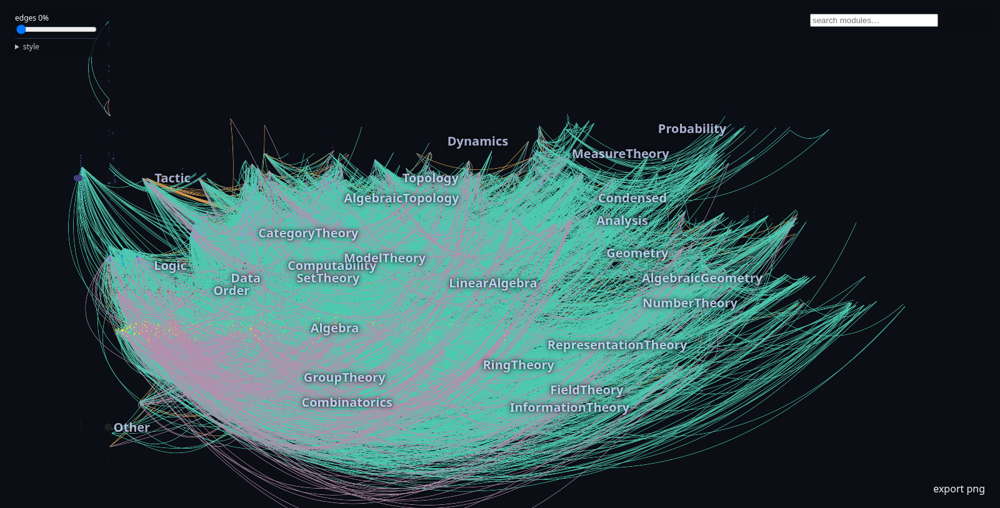

# LeanAtlas

An interactive atlas of [Lean 4](https://lean-lang.org) mathematics: a knowledge-graph
pipeline that turns a compiled Lean library (tested against
[Mathlib](https://github.com/leanprover-community/mathlib4)) into a Neo4j graph
of declarations and dependencies, plus a fast web explorer that maps the whole
library at a glance — module dependency structure, class hierarchies
(`extends`), typeclass wiring (`instances`), and structure fields.



## What you get

- **A knowledge graph of 625k+ declarations and 11.6M kernel-level dependency
  edges** (plus `EXTENDS` / `INSTANTIATES` / `HAS_FIELD` / `HAS_CONSTRUCTOR`
  structural relations), loaded into Neo4j.
- **A layout engine** (`leanatlas layout`) that computes a deterministic
  module map: x = transitive-closure size (foundations left, apex right),
  y = topic bands, radius = PageRank — exported as a small `data.json`.
- **A zero-install explorer** (Vite + React + sigma.js): search & fly-to,
  transitive-closure highlighting, structure-edge overlay with per-relation
  color/curvature controls, URL deep links, PNG export.

The explorer runs entirely client-side: with the prebuilt `data.json` you can
browse the atlas of Mathlib without installing Lean or Neo4j at all.

## How it works

```
 .lean sources          compiled env              Neo4j KG                browser
┌──────────────┐   ┌───────────────────┐   ┌─────────────────┐   ┌────────────────┐
│ leanatlas    │   │ lake exe extract  │   │ leanatlas load  │   │ leanatlas      │
│ parse  ──────┼──▶│ (kernel truth:    │──▶│ (declarations,  │──▶│ layout ───────▶│ data.json
│ (regex)      │   │  deps, extends,   │   │  modules, ... ) │   │ (deterministic)│
└──────────────┘   │  instances, ...)  │   └─────────────────┘   └────────────────┘
                   └───────────────────┘
```

Module-level structure edges are aggregated with the compiler's own
defining-module mapping (`env.getModuleIdxFor?`), which catches
auto-generated and private declarations that source-regex parsing cannot see.

## Quickstart

Requirements: Python 3.12+ ([uv](https://docs.astral.sh/uv/) recommended),
Node 20.19+ (22 recommended) with pnpm, a [Neo4j 5.x](https://neo4j.com/download/) instance
(Community Edition is fine), and a local mathlib checkout with built
`.lake` (`lake exe cache get`).

```bash
git clone https://github.com/VANvonZHANG/LeanAtlas && cd LeanAtlas
uv pip install -e .
export LEANATLAS_NEO4J_URI=bolt://localhost:7687
export LEANATLAS_NEO4J_USER=neo4j LEANATLAS_NEO4J_PASSWORD=...
export LEANATLAS_MATHLIB_PATH=/path/to/mathlib4

# 1) parse module structure from sources
leanatlas parse --mathlib-path "$LEANATLAS_MATHLIB_PATH" --out structure.jsonl

# 2) extract kernel-truth records (deps, relations, defining module)
cd extract && lake exe extract Mathlib > ../extract.jsonl && cd ..
#    extract/ expects a mathlib4 checkout as a sibling of this repo
#    (../../mathlib4); edit extract/lakefile.toml's mathlib path otherwise

# 3) load the knowledge graph into Neo4j
leanatlas drop && leanatlas load --structure structure.jsonl --extract extract.jsonl

# 4) compute the deterministic module map for the explorer
leanatlas layout --structure structure.jsonl --topics web/topics.toml \
  --out web/public/data.json

# 5) explore
cd web && pnpm install && pnpm dev
```

The full pipeline over Mathlib takes about an hour (extraction ~20 min,
Neo4j load ~30 min); `leanatlas layout` alone is ~12 s.

## Exploring

- **Search** any module (Enter pins it and flies the camera there).
- **Pin** a module to light up its full transitive import closure.
- **Structure edges** (toggle per relation in the edge panel; defaults on):
  amber arcs = `extends` (class lineages), teal = `instances` (typeclass
  wiring), violet = field projections. Color and curvature are adjustable
  live; the state round-trips through the URL hash for shareable deep links.
- **Export** the current view as PNG (topic labels and edges included).

## Related work

- [LeanDojo](https://github.com/LeanDojo/LeanDojo) — theorem-proving trace
  data for ML; LeanAtlas focuses on structure & dependency cartography for
  humans.
- [MathlibExplorer](https://github.com/Crispher/MathlibExplorer) — an
  interactive 3D explorer of the mathlib import graph; LeanAtlas adds
  kernel-accurate declaration-level relations, structural overlays, and a
  zero-install web explorer.
- [import-graph](https://github.com/leanprover-community/import-graph) —
  module-level dot graphs; LeanAtlas adds declaration-level KG, structural
  relations, and the web explorer.

## License

MIT (see [LICENSE](LICENSE)). Neo4j itself is licensed separately by its
publishers (Community Edition: GPLv3) — you run your own instance.
